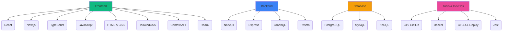

<h1 align="center">
  
</h1>

  

  
  
  
  

  <strong>Software Engineer | Full-Stack Developer</strong> 
  Construindo soluções escaláveis que resolvem problemas reais

  
  
  

   <strong>Open to Work</strong> — Remoto | Brasil | Portugal/Europa

---

##  Sobre mim

Sou **Engenheiro de Software Full-Stack** focado em construir sistemas que resolvem problemas reais de negócio.

Atuo com **Node.js, React e TypeScript**, desenvolvendo aplicações completas com foco em **arquitetura, escalabilidade e impacto prático**.

Tenho direcionado meus projetos para cenários reais de empresas, criando soluções que podem evoluir para produtos (SaaS), sempre priorizando organização, performance e clareza de código.

Recentemente desenvolvi o [Escola Gestão](https://github.com/RFernandes10/escola-gestao), um sistema de gestão escolar com integração de IA (Google Gemini) para relatórios executivos.

---

##  Projetos em Destaque

###  Escola Gestão - Sistema de Gestão Escolar com IA
🔗 [Repositório](https://github.com/RFernandes10/escola-gestao) · [Ver Projeto](#)

  

**Descrição:** Sistema completo de gestão escolar com foco em RH e integração de IA generativa.

**Funcionalidades:**
-  Gestão completa de funcionários (cadastro, edição, inativação)
-  Relatórios executivos com Google Gemini AI
-  Autenticação JWT com níveis de acesso (Diretor/Usuário)
-  Exportação para Excel e PDF
-  Interface moderna com tema escuro/claro

**Stack:** Next.js 14 · Node.js · TypeScript · PostgreSQL · Prisma · Google Vertex AI

---

###  Project Management Platform
🔗 [Repositório](https://github.com/RFernandes10/project-management-platform) · [Demo ao vivo](#)

  

**Descrição:** Plataforma full-stack de gerenciamento de projetos com metodologia Kanban.

**Funcionalidades:**
-  Quadros Kanban interativos com drag-and-drop
-  Gerenciamento de tarefas e prazos
-  Sistema de etiquetas e filtros
-  Relatórios de progresso em tempo real

**Stack:** React · TypeScript · Node.js · PostgreSQL · Redux Toolkit

---

###  GitHub Profile Explorer
🔗 [Repositório](https://github.com/RFernandes10/GitHub_Profile_Explorer) · [Demo ao vivo](https://rfernandes10.github.io/GitHub_Profile_Explorer/)

  

**Descrição:** Visualizador moderno de perfis do GitHub com informações completas.

**Funcionalidades:**
-  Busca de usuários do GitHub
-  Exibição de repositórios, stars e seguidores
-  Interface limpa e intuitiva
-  Dados em tempo real via GitHub API

**Stack:** HTML5 · CSS3 · JavaScript · GitHub API

---

###  Autoparts System - Controle de Estoque
🔗 [Repositório](https://github.com/RFernandes10/autoparts-system) · [Demo ao vivo](#)

  

**Descrição:** Sistema completo de gestão para lojas de autopeças com controle de estoque e vendas.

**Funcionalidades:**
-  Cadastro de produtos (pneus, baterias, autopeças)
-  Gestão de clientes e fornecedores
-  Dashboard gerencial com estatísticas
-  Registro de vendas com atualização automática

**Stack:** React · TypeScript · Node.js · PostgreSQL · Prisma

---

##  Tech Stack

---

##  Estatísticas

  
  
   
  

---

##  Diferenciais

-  Desenvolvimento Full-Stack end-to-end
-  Foco em problemas reais de negócio
-  Alta produtividade com uso de IA
-  Arquitetura escalável (SaaS)
-  Preparado para atuação internacional

---

##  Contato

  
  
  

  <h3> Open to Work | Remoto Brasil / Portugal / Europa</h3>
  <em>Construindo soluções com impacto real 🚀</em>

---

  

