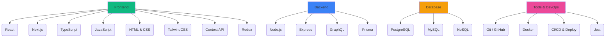

<h1 align="center">
  
</h1>

  

  
  
  
  

  <strong>Software Engineer | Full-Stack Developer</strong> 
  Construindo soluções escaláveis que resolvem problemas reais

  
  
  

   <strong>Open to Work</strong> — Remoto | Brasil | Portugal/Europa

---

##  Sobre mim

Sou **Engenheiro de Software Full-Stack** focado em construir sistemas que resolvem problemas reais de negócio.

Atuo com **Node.js, React e TypeScript**, desenvolvendo aplicações completas com foco em **arquitetura, escalabilidade e impacto prático**.

Tenho direcionado meus projetos para cenários reais de empresas, criando soluções que podem evoluir para produtos (SaaS), sempre priorizando organização, performance e clareza de código.

---

##  Projetos com Impacto Real

###  Business Manager SaaS *(em desenvolvimento)*
🔗 [Repositório](#) · [Demo ao vivo](#)

<!-- Substitua pela URL da imagem/GIF do projeto -->

  

**Público:** Pequenos negócios (barbearias, autônomos, serviços locais)

**Problema:** Falta de organização, controle financeiro e gestão centralizada

**Solução:**
-  Agendamentos
-  Gestão de clientes
-  Controle financeiro
-  Dashboard

**Diferencial:** Arquitetura **multi-tenant (SaaS)**

**Stack:** Node.js · React · PostgreSQL · Prisma · JWT

---

###  Sistema de Agendamento (Clínicas)
🔗 [Repositório](#) · [Demo ao vivo](#)

<!-- Substitua pela URL da imagem/GIF do projeto -->

  

**Problema:** Desorganização de agenda e perda de atendimentos

**Solução:**
- Gestão de horários
- Controle de pacientes
- Relatórios operacionais

---

###  Controle de Estoque Inteligente
🔗 [Repositório](#) · [Demo ao vivo](#)

<!-- Substitua pela URL da imagem/GIF do projeto -->

  

**Problema:** Falta de controle gera prejuízo

**Solução:**
- Controle de produtos
- Alertas de reposição
- Histórico de movimentação

---

###  Gerador de Orçamentos
🔗 [Repositório](#) · [Demo ao vivo](#)

<!-- Substitua pela URL da imagem/GIF do projeto -->

  

**Problema:** Orçamentos informais e desorganizados

**Solução:**
- Geração de PDF
- Cadastro de clientes
- Histórico de serviços

---

##  Tech Stack

---

##  Estatísticas

  
  
   
  

---

##  Diferenciais

-  Desenvolvimento Full-Stack end-to-end
-  Foco em problemas reais de negócio
-  Alta produtividade com uso de IA
-  Arquitetura escalável (SaaS)
-  Preparado para atuação internacional

---

##  Contato

  
  
  

  <h3> Open to Work | Remoto Brasil / Europa</h3>
  <em>Construindo soluções com impacto real 🚀</em>

